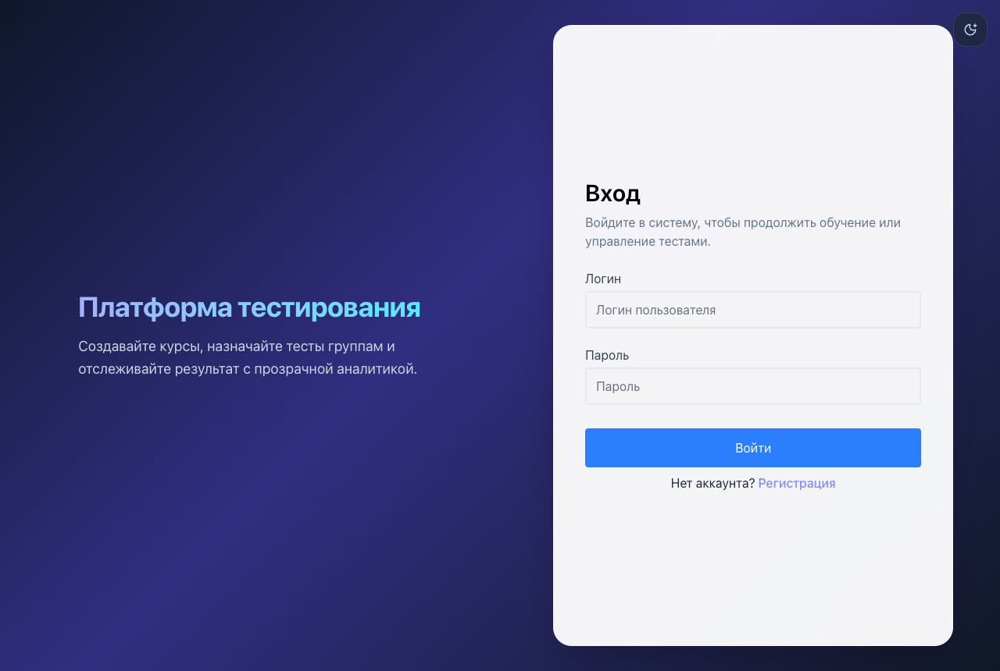
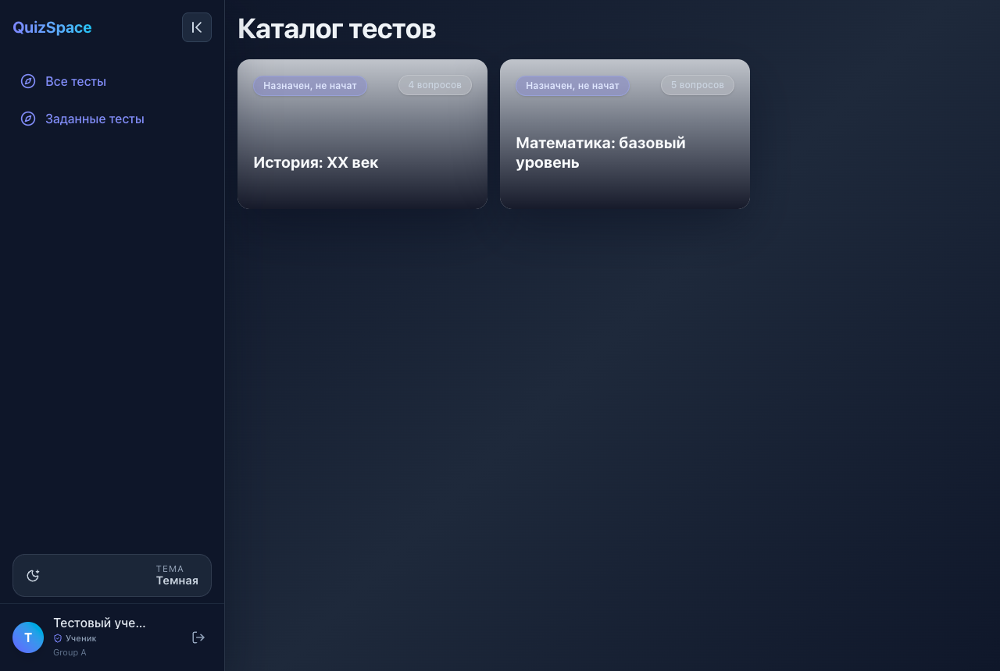
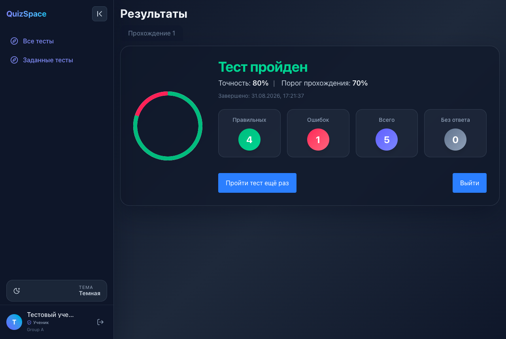
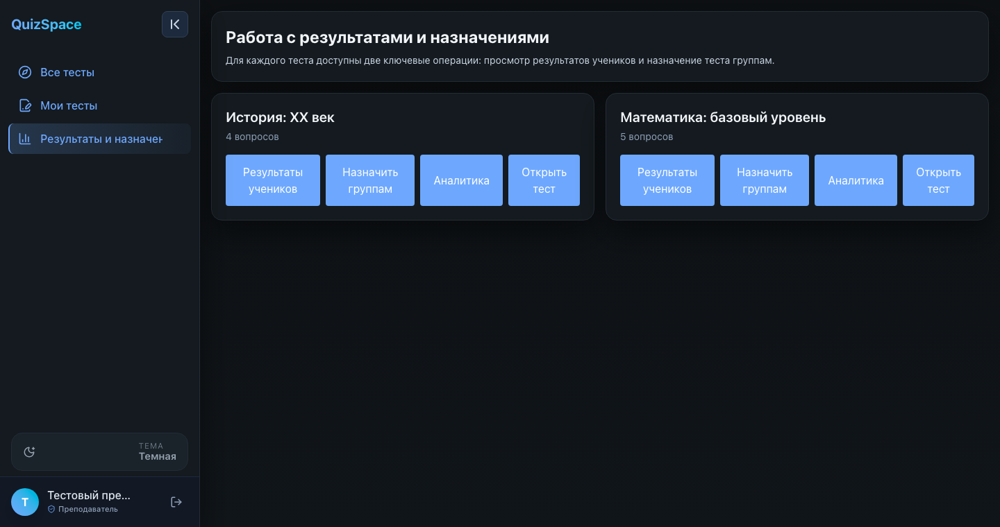

# QuizSpace — платформа тестирования (LMS)

**EN.** A role-based quiz/LMS platform: React + Vite + TypeScript on the front, Express + PostgreSQL on the back, wrapped in Docker Compose with healthchecks and an idempotent seed. Leadership creates groups and teachers, teachers author quizzes and assign them to groups, students take the tests and get scored instantly. There is no hosted demo because the app needs its own PostgreSQL — instead the whole stack comes up with a single command and ships with pre-seeded demo accounts and quizzes.

Живого демо нет намеренно: приложению нужна своя база PostgreSQL. Вместо этого весь стек поднимается **одной командой** и сразу содержит демо-аккаунты, группы и готовые тесты.

---

## Быстрый старт

```bash
docker compose up -d --build
```

Больше ничего не нужно: `.env` не обязателен, все значения по умолчанию уже заданы в `docker-compose.yml`.
Compose сам поднимет PostgreSQL, дождётся его healthcheck, применит схему и seed, затем запустит бэкенд и фронтенд.

Когда все три контейнера станут `healthy` (обычно 30–60 секунд), открывайте:

| Сервис | Адрес |
| --- | --- |
| Фронтенд | http://localhost:8088 |
| API | http://localhost:5051 |
| Health-check бэкенда | http://localhost:5051/health |
| PostgreSQL | `localhost:55432` |

Остановить и удалить данные:

```bash
docker compose down -v
```

Порты нестандартные специально — `8080`, `5432` и `5000` слишком часто уже заняты. Переопределить можно через `.env`
(см. `.env.example`): `FRONTEND_PORT`, `BACKEND_PORT`, `POSTGRES_PORT`.

## Демо-доступы

Пароль у всех демо-аккаунтов — `P@ssw0rd`.

| Роль | Логин | Что видно после входа |
| --- | --- | --- |
| Руководство | `admin` | Управление: создание групп и преподавателей |
| Преподаватель | `teacher` | Свои тесты, назначение группам, результаты учеников |
| Ученик | `student` | Заданные тесты, прохождение, личная статистика |

Дополнительно засеяны группы `Group A` и `Group B`, тесты «Математика: базовый уровень» (5 вопросов) и
«История: XX век» (4 вопроса); ученик `student` состоит в `Group A`, обоим тестам эта группа уже назначена.

Код регистрации руководства — `lead-123` (переменная `LEADERSHIP_REGISTRATION_CODE`).

## Роли и права

| Возможность | Ученик | Преподаватель | Руководство |
| --- | :---: | :---: | :---: |
| Проходить назначенные тесты | + | – | – |
| Своя статистика и история попыток | + | – | – |
| Создавать и редактировать тесты | – | + | + |
| Загружать картинки к тестам и вопросам | – | + | + |
| Назначать тесты группам | – | + | + |
| Смотреть результаты учеников | – | + (свои группы) | + |
| Создавать группы | – | – | + |
| Заводить преподавателей | – | – | + |

Роль зашивается в JWT при входе; на сервере её проверяет `roleMiddleware`, на клиенте — `RoleGuard`.

## Скриншоты

| Вход | Каталог тестов (ученик) |
| --- | --- |
|  |  |

| Результат прохождения | Результаты учеников (преподаватель) |
| --- | --- |
|  |  |

## Архитектура

```
docker-compose.yml          оркестрация трёх сервисов + healthcheck + volumes
docker/postgres/init/       схема БД и идемпотентный seed, применяется при первом старте
quiz-app-client/            React 19 + Vite + TypeScript + Tailwind, отдаётся nginx
quiz-app-server/            Express + PostgreSQL (pg), JWT-авторизация
```

- **postgres** — PostgreSQL 16, схема и демо-данные накатываются из `docker-entrypoint-initdb.d`.
- **backend** — стартует только после `service_healthy` у базы; отдаёт `/health` для собственного healthcheck.
- **frontend** — сборка Vite внутри Docker, готовый бандл раздаёт nginx; он же проксирует `/api/` на бэкенд,
  поэтому фронтенду не нужен отдельный `VITE_API_URL` и нет проблем с CORS.

Загрузки пользователей живут в volume `backend_uploads`, а не в git.

### Стек

React 19, Vite, TypeScript, Tailwind CSS, React Router, lucide-react ·
Express, PostgreSQL 16, `pg`, JWT, bcryptjs, express-validator, express-rate-limit, multer ·
Docker Compose, nginx.

## Проверка без браузера

Готовый смоук-тест поднятого стека — health, вход всеми ролями, данные seed и разграничение прав:

```bash
./scripts/smoke.sh
```

```
  ok    фронтенд отдаёт страницу — 200
  ok    бэкенд /health — 200
  ok    вход: admin — 200
  ok    ученик не видит результаты учеников — 403
  ok    ученик не может залить картинку теста — 403
  ...
  Все проверки прошли.
```

Отдельные запросы вручную:

```bash
# health
curl http://localhost:5051/health

# вход демо-ученика
curl -X POST http://localhost:8088/api/auth/login \
  -H 'Content-Type: application/json' \
  -d '{"username":"student","password":"P@ssw0rd"}'

# карточки тестов
curl http://localhost:8088/api/quizzes/cards
```

## Переменные окружения

Все значения имеют рабочие значения по умолчанию, `.env` нужен только чтобы что-то поменять —
скопируйте `.env.example` в `.env`. Ключевое для не-локального запуска: задать длинный случайный `APP_SECRET`
(им подписываются JWT) и свой `LEADERSHIP_REGISTRATION_CODE`.

---

Студия Лендвис · [landvis.ru](https://landvis.ru)
